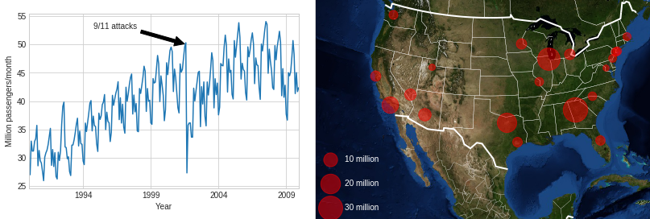
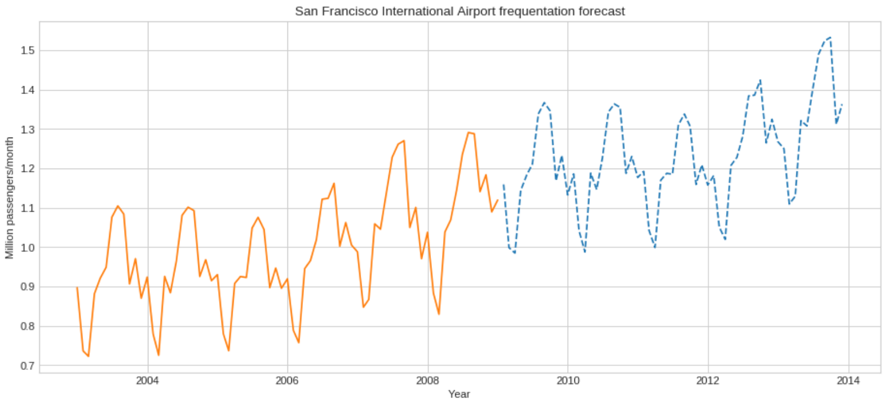

# Analysing and Preciting US Domestic Flights (1990-2008)

- Roughly 3 **MILLION** lines !
- Based on this [Public Dataset](http://academictorrents.com/details/a2ccf94bbb4af222bf8e69dad60a68a29f310d9a) published by the US Census Bureau  

# Predicting future traffic

Using Fast-Fourier-Transform, we can forecast passenger traffic based on cyclic tendancies.

If you want to improve prediction with differents time series forecasting algorithms, pull-requests are welcome !

# Run
This is a Jupyter Notebook.
You can run it [locally](https://github.com/jupyter/notebook) or in [Google Colab](https://colab.research.google.com/drive/1vay6WZ1HRh9Lj3HwmYi_87bv8mUo5KU0)

# Are you looking for a Data Scientist ? 
- I'm looking for a **Master Internship** in **2020** in **North America** !
- Please check out my [Resume.](https://arnaud.at/cv)
